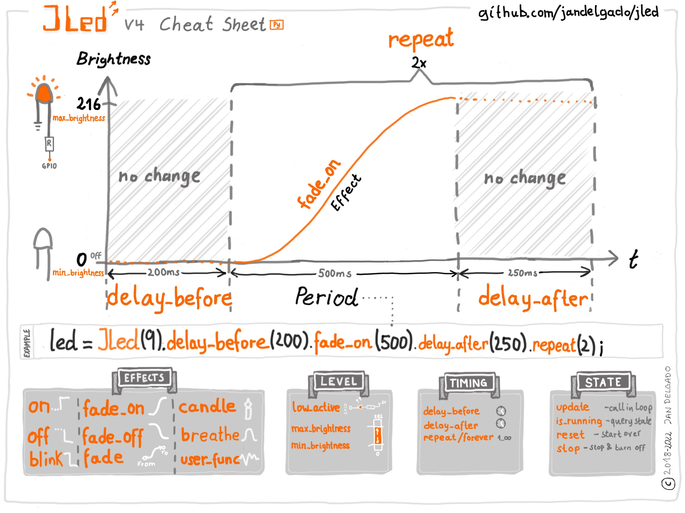

Introduction
============

.. image:: https://github.com/jandelgado/jled-circuitpython/workflows/Build%20CI/badge.svg
    :target: https://github.com/jandelgado/jled-circuitpython/actions
    :alt: Build Status

.. image:: https://img.shields.io/badge/code%20style-black-000000.svg
    :target: https://github.com/psf/black
    :alt: Code Style: Black

.. image:: https://img.shields.io/badge/-API%20documentation-brightgreen
    :target: https://jandelgado.github.io/jled-circuitpython
    :alt: API Documentation

An embedded library for Python to control LEDs. It uses a **non-blocking**
approach and can control LEDs in simple (**on**/**off**) and complex
(**blinking**, **breathing** and more) ways in a **time-driven** manner.

This is a pure Python port of my `JLed <https://github.com/jandelgado/jled>`_
C++ library.

.. image:: .images/jled.gif
    :alt: JLed in action

Features
========

- non-blocking
- effects: simple on/off, breathe, blink, candle, fade, user-defined
- supports inverted  polarity of LED
- easy configuration using fluent interface
- can control groups of LEDs sequentially or in parallel
- supports CircuitPython and MicroPython

Usage Example
=============

Test JLed interactively in a CircuitPython REPL:

.. code-block::

  Adafruit CircuitPython 7.3.3 on 2022-08-29; Raspberry Pi Pico with rp2040
  >>> import board
  >>> from jled import JLed
  >>> led=JLed(board.LED).breathe(500).delay_after(250).repeat(5)
  >>> while led.update(): pass

This creates a JLed object connected to the builtin LED (``board.LED``), with a
breathe effect that is repeated 5 times.  Each iteration is followed by a delay
of 250 ms, before starting again.  By calling ``led.update()`` periodically,
the LED gets physically updated. Alternatively ``play(led)`` can be call in the
REPL as a shortcut.  Once finished, call ``led.reset()`` before playing the
effect again.

Cheat Sheet
===========



Installation
=============

On supported GNU/Linux systems like the Raspberry Pi (with `Adafruit-Blinka
<https://pypi.org/project/Adafruit-Blinka/>`_), you can install the lib
locally `from PyPI <https://pypi.org/project/circuitpython-jled/>`_.  To
install for current user:

.. code-block:: shell

    pip3 install circuitpython-jled

To install system-wide (this may be required in some cases):

.. code-block:: shell

    sudo pip3 install circuitpython-jled

To install in a virtual environment in your current project:

.. code-block:: shell

    mkdir project-name && cd project-name
    python3 -m venv .venv
    source .env/bin/activate
    pip3 install circuitpython-jled

Installing to a Connected CircuitPython Device with Circup
----------------------------------------------------------

``JLed`` is available in the `Circuitpython Community Bundle <https://github.com/adafruit/CircuitPython_Community_Bundle>`_ 
and can easily installed with `circup <https://pypi.org/project/circup/>`_ by 
running::

    $ circup install jled

Optionally copy also one of the example as ``main.py`` to the root of the filesystem. 

Installing on a MicroPython device
----------------------------------

Create a directory called ``jled`` on the device and `copy
<https://pypi.org/project/mpremote/>`_ the following files into this directory:
into this directory: ``jled.py``, ``jled_sequence.py``
``hal_pwm_micropython.py``, ``hal_time_micropython.py``, ``play.py``,
``__init__.py```. Optionally also copy one of the example as ``main.py`` to the
root of the filesystem.  The overall structure is:

.. code-block::

   /
   ├─ main.py
   └─ jled
       ├─ __init__.[m]mpy
       ├─ hal_pwm_micropython.[m]mpy
       ├─ hal_time_micropython.[m]mpy
       ├─ jled.[m]mpy
       ├─ jled_sequence.[m]mpy
       └─ play.[m]mpy

To reduce memory consumption, Python source files can be compiled to binary
``mpy`` format using the `mpy-cross <https://pypi.org/project/mpy-cross/>`_
tool. For convenience, a script to compile and copy jled to a connected device
is provided here (see ``scripts/install_mp.sh``).

Documentation
=============

`API documentation for this library can be found on here
<https://jandelgado.github.io/jled-circuitpython/>`_.

Rebuild the documentation with ``sphinx-build -E -W -b html . _build/html``
in the ``docs`` directory. Run ``pip install ".[optional]"`` before to install
build-time dependency `Sphinx <https://www.sphinx-doc.org/>`_

Tests
=====

Unit tests (using https://docs.pytest.org) are provided, run the tests with:

.. code-block::

   $ pip install ".[optional]"
   $ pytest

To run the ``pre-commit-hook`` locally, run ``pre-commit run --all-files``

Author & Copyright
==================

Copyright © 2022-2023 by Jan Delgado, License: MIT
